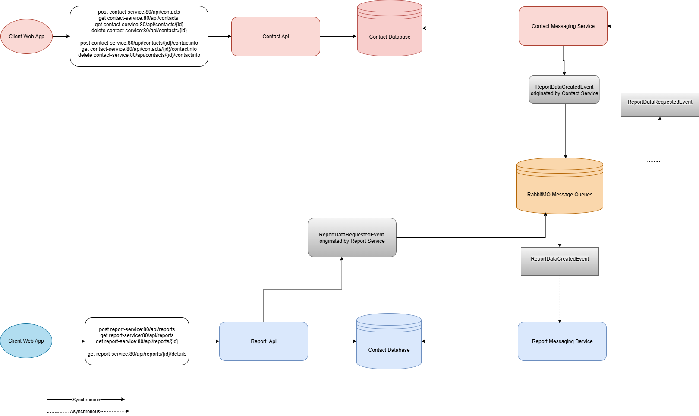

# 📞 Phonebook Microservices Solution

A modular, event-driven phonebook application built with ASP.NET Core, RabbitMQ, PostgreSQL, and Docker. Designed for maintainability, scalability, and clean separation of concerns.

---

## 🧱 Solution Structure
```
Phonebook/
├── Clients/
│   └── Phonebook.Web/                         # Web frontend
├── Deployments/
│   └── docker-compose.yml                     # Deployment configuration
├── Docs/
│   ├── architecture.png                       # System architecture diagram
│   └── coverage-report.pdf                    # Test coverage report
├── Services/
│   ├── ContactManagement/
│   │   ├── ContactManagement.Api/             # REST API for contacts
│   │   ├── ContactManagement.Messaging.Service/ # RabbitMQ consumer
│   │   └── ...                                # Domain, Application, Infrastructure
│   └── ReportManagement/
│       ├── ReportManagement.Api/              # REST API for reports
│       ├── ReportManagement.Messaging.Service/ # RabbitMQ consumer
│       └── ...                                # Domain, Application, Infrastructure
├── Shared/
│   └── ...                                    # Shared contracts, messaging, common utilities

---

## 🚀 Running the Project

### 🛠 Requirements

- .NET 8 SDK
- Docker & Docker Compose

### ▶️ Quick Start

1. Clone the repository
   git clone https://github.com/yourusername/phonebook.git
   cd phonebook/Deployments

2. Build and run the solution
   docker-compose up --build

3. Access the services
   - Phonebook Web: http://localhost:53000
   - Contact API: http://localhost:50501/api/contacts
   - Report API: http://localhost:50502/api/reports
   - RabbitMQ UI: http://localhost:15673 (guest/guest)

---

## 📊 Test Coverage

The solution includes unit and integration tests across all layers. Coverage report is available in:

📄 [View Coverage Report](Docs/Code_coverage.pdf)

---

## 🧭 Architecture Overview



- Microservices communicate via RabbitMQ
- PostgreSQL used for persistence
- Frontend interacts with APIs directly
- Messaging services handle background tasks and events

---

## 🧪 Projects with Tests

- ContactManagement.Tests
- ReportManagement.Tests

Run tests via Visual Studio Test Explorer or CLI:
dotnet test

---

## 📦 Docker Ports Summary

| Service                  | Port     |
|--------------------------|----------|
| Phonebook Web            | 53000    |
| Contact API              | 50501    |
| Report API               | 50502    |
| PostgreSQL               | 55432    |
| RabbitMQ (AMQP)          | 55672    |
| RabbitMQ (Management UI) | 15673    |

---

## 👨‍💻 Author

**Mehmet Recep Yildiz**  
Senior Software Developer & Architect  
Focused on backend architecture, event-driven systems, and deployment clarity.

---

## 📄 License

MIT License — feel free to use, modify, and share.
